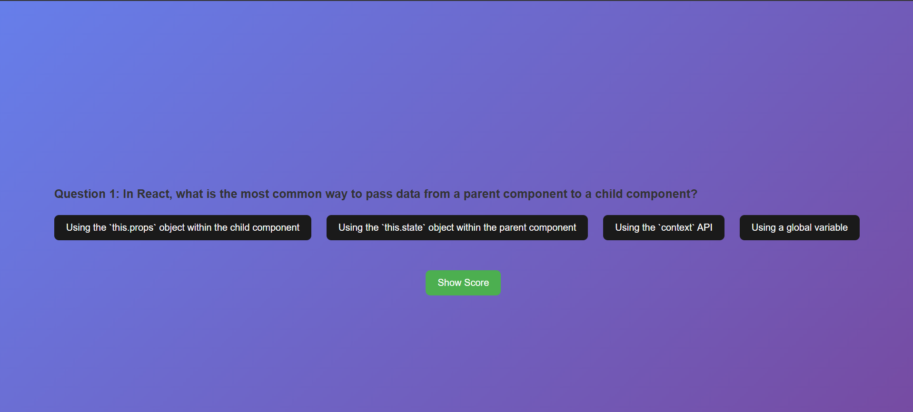
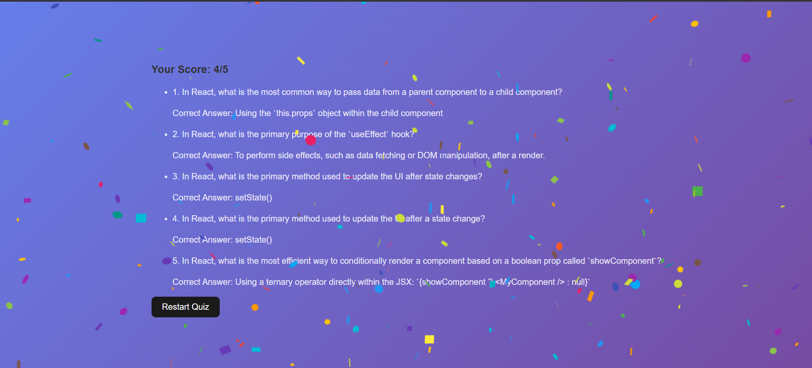

# Coding Quiz Generator
# Not major project, just trying to make which i can think :)
## Overview

The Coding Quiz Generator is an interactive web application that presents coding-related quiz questions. It integrates with the Gemini API for fetching questions and provides a celebration effect when the user correctly answers more than three questions. The project is built using React for the frontend and Node.js with Express.js for the backend.

## Features

- **Dynamic Questions**: Questions are fetched from the Gemini API.
- **Interactive UI**: Modern and engaging user interface for a smooth experience.
- **Celebration Effect**: If the user answers more than 3 questions correctly, a special celebration animation is triggered.
- **Backend Integration**: Node.js and Express.js handle API requests and data processing.

## Tech Stack

- **Frontend**: React, Tailwind CSS (or other UI libraries for styling)
- **Backend**: Node.js, Express.js
- **API Integration**: Gemini API
- **State Management**: React Hooks / Context API

## Installation & Setup

### Prerequisites

- Node.js and npm installed
- A Gemini API key (if required for fetching questions)

### Steps to Run Locally

1. **Clone the repository:**
    ```sh
    git clone https://github.com/yourusername/Coding-Quiz-Generator.git
    cd Coding-Quiz-Generator
    ```

2. **Setup Backend:**
    ```sh
    cd backend
    npm install
    node server.js
    ```

3. **Setup Frontend:**
    ```sh
    cd vite-project
    npm install
    npm start
    ```

4. **Access the App:**
    Open [http://localhost:3000](http://localhost:5000) in your browser.

## API Endpoints

| Method | Endpoint       | Description                                |
|--------|----------------|--------------------------------------------|
| GET    | /api/questions | Fetch coding quiz questions from Gemini API|
| POST   | /api/submit    | Validate user answers and return the score |

## How It Works

1. The frontend fetches quiz questions from the backend, which retrieves data from the Gemini API.
2. Users answer the five coding-related questions.
3. The backend evaluates answers and returns a score.
4. If the user gets more than three correct, a celebration animation is triggered.

## Future Enhancements

- Add more difficulty levels
- Implement a leaderboard system
- Include a timer for each question

## Contributing

We welcome contributions! Please follow these steps:

1. Fork the repository.
2. Create a new branch (`git checkout -b feature-branch`).
3. Make your changes.
4. Commit your changes (`git commit -m 'Add some feature'`).
5. Push to the branch (`git push origin feature-branch`).
6. Open a pull request.

## License

This project is licensed under the MIT License. See the LICENSE file for details.

## Landing Page




Happy Coding! 🚀
